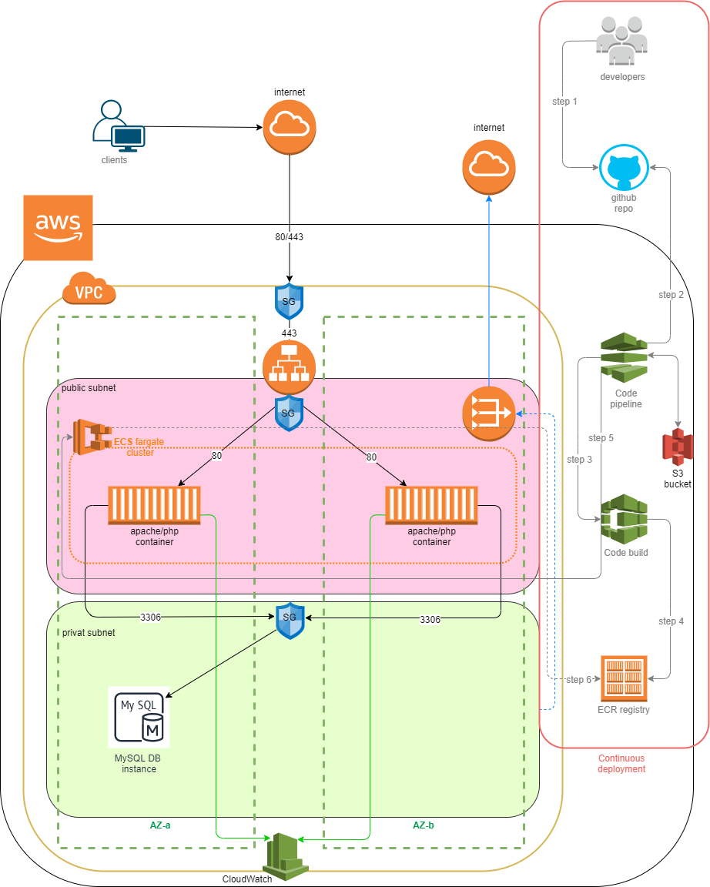

# This repo covers CloudFormations templates to install and configure LAMP service with MariaDB with continuous deployment pipeline using AWS resources (VPC, subnets, LB, ECS-fargate, MariaDB, CodePipeline, CodeBuild ...)  

  

## Disclaimer

This is only for testing purpose with mainly focus on CloudFormation infrastructure concept templates and less on content of LAMP container  

  

## Infrastructure diagram

  

## Architecture overview

As seen from the infrastructure diagram this architecture is divided into two interconnected units:

### application architecture 

This concept presents application part (apache/php) using provided build Dockerfile who'll be pushed in to AWS ECS cluster (type fargate) widespread between two availability zone using public subnet (private VPC) as frontend part of service and separated from private subnet as backend part of service (db). In front of them is ALB (application HTTP/HTTPS load balancer) who forward outside requests to frontend containers in ECS cluster.

### continuous deployment architecture 

This concept presents continuous deployment consist of six steps provided by AWS services (CodePipeline, CodeBuild, Elastic Container Registry, S3 bucket) with this source code repository (GitHub). 

Description of continuous deployment steps:
- **Step 1** – developers create/modify source code and push to master branch of source repository service (in our case GitHub)
- **Step 2** – AWS CodePipeline pulls the source code from repository and triggers execution of pipeline
- **Step 3** – AWS CodePipeline executes build process on AWS CloudBuild who creates/builds Docker image 
- **Step 4** – AWS CodeBuild push newly created image to ECR (Elastic Container Registry) with tag and revision ID
- **Step 5** – AWS CodePipeline initiates an update of ECS task and service definition with new image location
- **Step 6** – AWS ECS fetchs container image from ECR and replaces image on the ECS cluster which brings us to the end of deployment process 

Deployment swapping over process from old to new image are defined without down time because of ECS service ‘DeploymentConfiguration’ parameters

  

## Implementation - CloudFormation

### Prerequisite:

 

- AWS account
- Created SSL certificate and uploaded on AWS Certificate Manager (IAM) which will be used by ALB – in this case for testing purpose it can be self-signed
- Source code provider account + token (in case of GitHub) 
- Pull container (Docker) build source code and push into your own source code provider on branch which is relevant for AWS CodePipeline setup

### Installation steps:

 

**Step 1:** Create stack (recommended name because of referencing: **network**) by uploading '**`step1-network.yaml`**' file

It will create resources:
-	VPC – included IP ranges depend (mappings) on environment (prod or dev) choice (CloudFormation parameters)
-	2 (for each availability zone) Public/Private subnets under created VPC - included IP ranges depend (mappings) on environment choice (prod, dev)
-	Internet gateway for VPC
-	Public/Private routing tables
-	NAT gw with Elastic IP for private subnet internet gateway
-	Output data for cross-stack reference

**Step 2:** Create stack (recommended name because of referencing: **db**) by uploading '**`step2-db.yaml`**' file

It will create resources:
-	RDS MariaDB instance - with included default parameters --> pay attention to environment choice (regarding to previous step env choice)
-	DB security group - allowing access to 3306 port only from public subnets (both zones)
-	DB subnet group - creates subnet group from private subnets
-	Output data for cross-stack reference and access data which will be needed in **step 5**

**Step 3:** Create stack (recommended name because of referencing: **lb**) by uploading '**`step3-lb.yaml`**' file

It will create resource
-	Public LB security group for access to public LB
-	Public HTTPS LB - needs pre-created certificate ARN  (defined in prerequisite chapter)
-	Dummy target group - it's needed because we still don't have created real targets (provided in **step 5**)
-	Public listener
-	Public redirect (http to https) listener
-	Output data for cross-stack reference and possible input in some of next stack (steps)

**Step 4:** Create stack (recommended name because of referencing: **ecs**) by uploading '**`step4-ecs_cluster.yaml`**' file

It will create resources:
-	ECS cluster – needed for ECS service (provided in step 5)
-	ESC security group with ingress for access to ECS containers from public LB and internal ECS connection
-	IAM role (ECSRole) – permissions needed for ECS networking (interfaces and LB) and for Docker container to change load balancer target group to the new pointing (containers) 
-	IAM role (ECSTaskExecutionRole) – allows Docker containers to create logs and also for ECR image work
-	Output data for cross-stack reference and possible input in some of next stack (steps)

**Step 5:** Create stack (recommended name because of referencing: **service**) by uploading '**`step5-service.yaml`**' file --> pay attention to empty parameters which need to be filled out with output access data (stack db – **step 2**)

It will create resources:
-	CloudWatch log group – needed for task definition which will send container logs to CloudWatch
-	Target group for LB
-	LB listener rule
-	ECS task definition – need for ECS container definition (resources, image, portmappings, env variables..) --> footnote: for initial task setup it is used 'amazon-ecs-sample' image because CI/CD pipeline stack will be created in next step and builded needed image
-	ECS service –  connects LB to ECS task definition and puts docker containers to public subnets
-	Output data for cross-stack reference and possible input in some of next stack (steps)

**Step 6:** Create stack (recommended name because of referencing: **pipeline**) by uploading '**`step6-continuous-deployment.yaml`**' file --> pay attention to empty parameters which need to be filled out with output access data (stack ecs – **step 4**, stack service – **step 5**, github data - defined in prerequisite chapter)

It will create resources:
-	ECR repository – place were builded container images are stored
-	IAM Role (CodeBuildServiceRole) – permissions needed for build process and work with services (ECR, S3, logs)
-	IAM Role (CodePipelineServiceRole) - permissions needed for build process and work with services (ECS, S3, CodeBuild)
-	S3 Bucket – needed for storing source code data during the build process
-	CloudBuild project – needed for build process defining build specification
-	CloudPipeline – needed for pipeline stages definition
-	Output data referencing to pipeline URL

 

***footnote:*** all this CloudFormation parameters could be done in a way that are hard-coded and cross-stack referenced directly in CF code for straightforward CF template deploy, but I purposely didn't do so to make the templates usable for other scenarios leaving room for  change parameters on-site when they are in process of deploying 

### Testing:
 
https://lb_dns_name/app1
 
https://lb_dns_name/app2

https://lb_dns_name/app3
